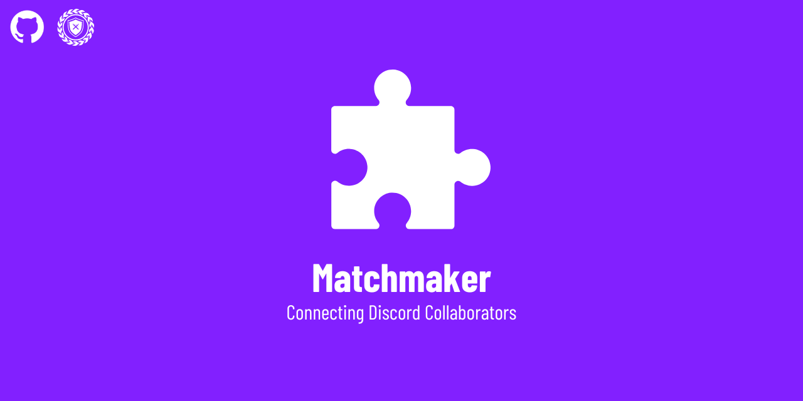

# 🤝 Orangery Matchmaker

Welcome to Orangery Matchmaker! It's a Discord bot dedicated to helping collaborators find each other and team up on projects. Our bot allows users to create profiles, specify their skills, and join or create lobbies for collaborative projects.

## ✨ Features

- **Profile Management**: Create and manage your profiles with ease using the `/profile` command. Set up your call name, bio, and available jobs.
- **Job Management**: Add or remove jobs to your profile using the `/setjobs` and `/removejob` commands, respectively. We provide autocomplete functionality to help you find existing jobs in the server.
- **Lobby Management**: Create a lobby for your projects with the `/createlobby` command. Manage your lobbies with commands like `/viewlobbystatus`, `/lobbyinfo`, `/kickfromlobby`, `/blockuser`, `/unblockuser`, and `/announce`.
- **Availability Status**: Let others know if you're available for projects using the `/available` command.
- **Joining Lobbies**: Join a lobby if there are available slots and you have the required skills using the `/joinlobby` command.
- **Activity Tracking**: We track user activity and provide a leaderboard of the most active users in the server.

## 🚀 Invite the bot!

You can invite the bot to your server using [this link](https://discord.com/oauth2/authorize?client_id=1246720080579133471&permissions=8&integration_type=0&scope=bot).

## 🔶 Our Headquarters

Join our Discord server to get help, report bugs, and suggest new features: [Orangery Matchmaker](https://discord.gg/2j9s6a42qx).

## 🛠️ Setup

1. Clone the repository.
2. Install the required dependencies listed in [`requirements.txt`](requirements.txt).
3. Set up your environment variables in a [`.env`](.env) file. The bot requires a Discord token, set as `DISCORD_TOKEN`, and a MongoDB connection string, set as `MONGO_URI`.
4. Run [`bot.py`](bot.py) to start the bot.

## 📜 License

This project is licensed under the GNU General Public License. For more details, see the [`LICENSE`](LICENSE) file.

## 🤝 Contributing

We welcome contributions! Please read the [`CODE_OF_CONDUCT.md`](CODE_OF_CONDUCT.md) and [`CONTRIBUTING.md`](CONTRIBUTING.md) files for more information on how to contribute.

## 📧 Contact

For more information on how to contact the author, please read the [`CONTACT.md`](CONTACT.md) file.

## 🎉 Acknowledgements

This bot uses the Py-Cord library to interact with the Discord API. For more information, visit the [Py-Cord GitHub repository](https://github.com/Pycord-Development/pycord).

(Created and maintained by The Orange Squad / Lyubomir Ternavskiy (LyubomirT) / Contributors)
